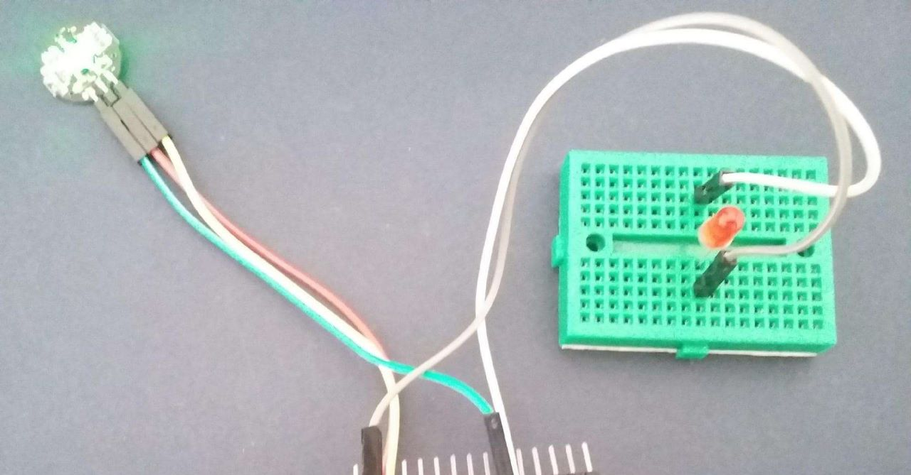
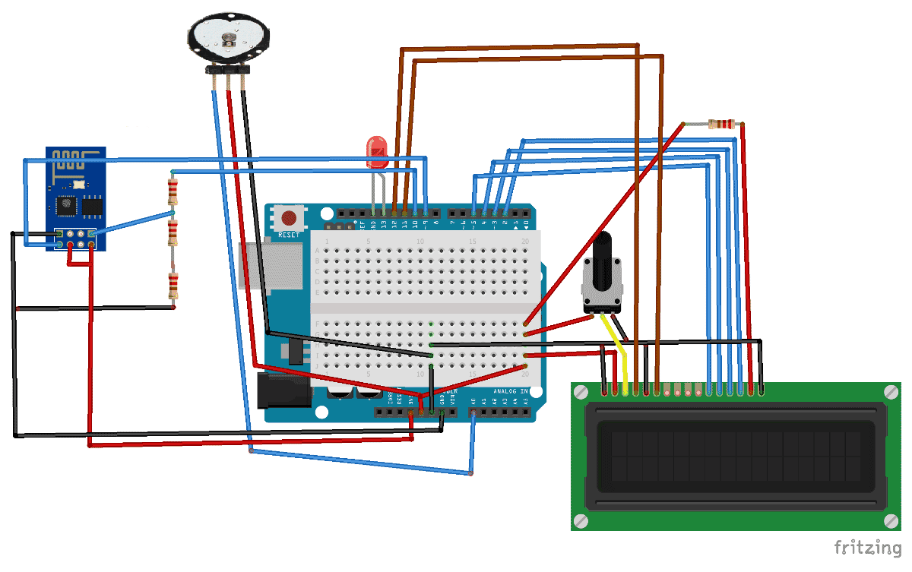

# Heart-Rate-Monitor

## Introduction
- Heart rate monitoring detection system using IoT. Nowadays
treatment of most of the heart-related diseases requires continuous as well as long term
monitoring.
 
 - IoT is very useful in this aspect as it replaces the conventional monitoring
systems with a more efficient scheme, by providing critical information regarding the
condition of the patient accessible by the doctor.
 - In addition, the nurses or the duty
doctor available at the hospital can monitor the heart rate of the patient in the serial
monitor through the real-time monitoring system.

## How It Works
- First we need to attach the Pulse Sensor to any organ of body where it can detect the pulse easily like finger. 
- Then the Pulse Sensor will measure the change in volume of blood, which occurs when every time heart pumps blood in the body. 
- This change in volume of blood causes a change in the light intensity through that organ.  The LED connected at pin will also blink according the Heart Beat.
- Then Heart Bit will show.

## IOT project 

## Hardware and Software used
1. NodeMCU
2. Pulse sensor
3. HC-05 Bluetooth
4. Jumper wires
5. Bread board
6. USB cable
7. Laptop

## Circuit Diagram

